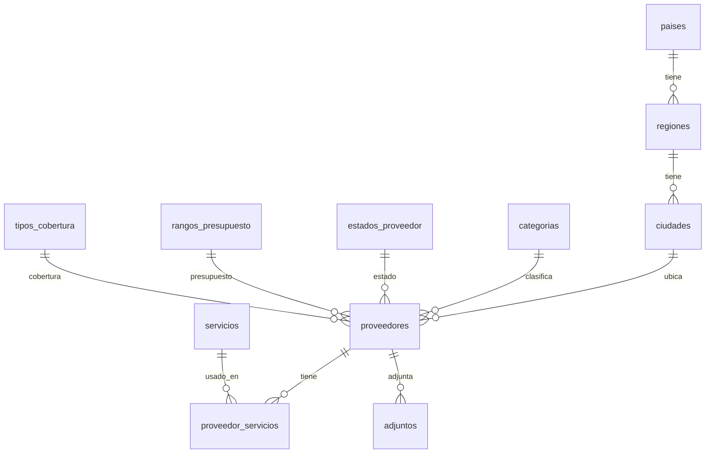

# Modelo relacional de ProveeHub

Este documento explica cómo se pasó de los datos planos del `index.html` original
(un arreglo de objetos JavaScript en memoria) a un esquema relacional normalizado
en PostgreSQL/Supabase, aplicando 1FN, 2FN, 3FN y 4FN.

Referencias usadas: freeCodeCamp — *Normalización de base de datos: 1NF, 2NF, 3NF*
([link](https://www.freecodecamp.org/espanol/news/normalizacion-de-base-de-datos-formas-normales-1nf-2nf-3nf-ejemplos-de-tablas/))
e IBM Db2 — *Normalization in database design*
([link](https://www.ibm.com/docs/es/db2-for-zos/13.0.0?topic=modeling-normalization-in-database-design)).

## 1. Punto de partida: la tabla plana original

Cada proveedor en el HTML era un único objeto con campos como:

```
{ id, nombre, pais, region, ciudad, cat, status, contacto, tel, email,
  score, budget, cobertura, servicios: "a, b, c", notas, attachments: [...] }
```

Problemas de diseño, mapeados a las formas normales que los resuelven:

| Problema detectado | Forma normal que lo corrige |
|---|---|
| `servicios` es una lista separada por comas dentro de una sola celda (no atómica) | 1FN |
| `attachments` es un arreglo anidado dentro de la fila | 1FN |
| `pais`, `region`, `ciudad` se repiten textualmente en cada proveedor que comparte ubicación | 2FN / 3FN |
| `cat`, `status`, `budget`, `cobertura` son strings libres repetidos sin catálogo ni control de integridad | 3FN |
| `ciudad` determina `region`, y `region` determina `pais` — pero los tres se guardaban juntos en la misma fila (dependencia transitiva) | 3FN |
| `servicios` (multivaluado) y `attachments` (multivaluado) son hechos independientes entre sí; combinarlos en una sola tabla produciría un producto cartesiano artificial | 4FN |

## 2. Primera forma normal (1FN)

**Regla:** cada celda contiene un único valor atómico, hay clave primaria, y no hay
grupos repetitivos ni columnas duplicadas.

Acciones:
- `servicios` (texto con comas) → tabla `servicios` (catálogo) + tabla puente
  `proveedor_servicios` (relación N:M).
- `attachments` (arreglo embebido) → tabla `adjuntos`, una fila por archivo/link,
  con `proveedor_id` como clave foránea.
- Cada tabla resultante tiene clave primaria explícita (`id` o clave compuesta).

## 3. Segunda forma normal (2FN)

**Regla:** ya en 1FN, y todo atributo no clave depende de la **clave completa**,
no de una parte de ella (esto solo aplica a tablas con clave compuesta).

La tabla `proveedor_servicios` tiene clave compuesta `(proveedor_id, servicio_id)`
y no almacena ningún atributo adicional que dependa solo de una mitad de la clave,
así que cumple 2FN trivialmente. El resto de tablas usan clave simple (`id`),
por lo que 2FN se cumple automáticamente en ellas.

## 4. Tercera forma normal (3FN)

**Regla:** ya en 2FN, y ningún atributo no clave depende **transitivamente** de
la clave primaria (es decir, ningún atributo no clave depende de otro atributo
no clave).

Este es el cambio más visible respecto al HTML original:

- **Ubicación.** En la tabla plana, `ciudad → region → pais` formaba una cadena de
  dependencias transitivas dentro de la misma fila (si conoces la ciudad, conoces
  la región; si conoces la región, conoces el país — exactamente el ejemplo
  `state_code → home_state` del artículo de freeCodeCamp). Se dividió en tres
  tablas encadenadas por FK: `paises ← regiones ← ciudades`. `proveedores` ahora
  solo guarda `ciudad_id`; país y región se obtienen siguiendo la cadena de claves
  foráneas, sin redundancia.
- **Catálogos de dominio.** `categoria`, `estado`, `rango_presupuesto` y
  `tipo_cobertura` pasaron de ser strings repetidos a tablas catálogo
  (`categorias`, `estados_proveedor`, `rangos_presupuesto`, `tipos_cobertura`)
  referenciadas por FK. Esto también habilita integridad referencial (no se puede
  guardar un estado que no exista) y, de paso, centraliza metadatos de UI como el
  color del badge (`estados_proveedor.color_bg/color_fg`), que antes vivían
  hardcodeados en JavaScript y dependían transitivamente del nombre del estado.

## 5. Cuarta forma normal (4FN)

**Regla:** ya en 3FN (de hecho, en BCNF), y no existen dos o más dependencias
multivaluadas independientes mezcladas en la misma tabla.

Un proveedor tiene **dos** hechos multivaluados independientes entre sí: su lista
de *servicios* y su lista de *adjuntos*. Ninguno depende del otro. Si se hubieran
modelado en una sola tabla ancha (por ejemplo, una fila por cada combinación de
servicio × adjunto), se habría introducido redundancia combinatoria: para añadir
un nuevo adjunto habría que repetirlo una vez por cada servicio existente, y
viceversa. Por eso cada dependencia multivaluada vive en su propia tabla,
relacionada con `proveedores` únicamente a través de `proveedor_id`:

- `proveedor_servicios (proveedor_id, servicio_id)`
- `adjuntos (id, proveedor_id, ...)`

Con esto el modelo queda en 4FN: cada tabla expresa un único hecho (o una única
relación N:M) por fila.

## 6. Esquema final

```
paises (id, nombre, codigo_iso, bandera_emoji, etiqueta_region)
  └─< regiones (id, pais_id→paises, nombre)
        └─< ciudades (id, region_id→regiones, nombre)

categorias (id, nombre)
estados_proveedor (id, nombre, color_bg, color_fg, orden)
rangos_presupuesto (id, nombre, orden)
tipos_cobertura (id, nombre, orden)
servicios (id, nombre)

proveedores (
  id, nombre,
  categoria_id    → categorias,
  estado_id       → estados_proveedor,
  ciudad_id       → ciudades,
  presupuesto_id  → rangos_presupuesto,
  cobertura_id    → tipos_cobertura,
  contacto_nombre, telefono, email, score, notas,
  created_at, updated_at
)

proveedor_servicios (proveedor_id→proveedores, servicio_id→servicios)  -- N:M
adjuntos (id, proveedor_id→proveedores, tipo, nombre, url, storage_path, mime, meta, tamano_bytes, creado_en)
```

Diagrama entidad-relación:



## 7. Vista y funciones que simplifican el acceso desde la app

Normalizar a costa de la legibilidad no sería práctico para un MVP, así que el
esquema (`supabase/01_schema.sql`) agrega:

- **Vista `proveedores_detalle`**: une todas las tablas y agrega `servicios` como
  JSON y `adjuntos_count`, para que el frontend lea con una sola consulta en vez
  de hacer N+1 joins manuales.
- **Función `guardar_proveedor(...)`**: hace el alta/edición completa (proveedor +
  resolución/creación de ubicación + reemplazo de servicios) en una sola
  transacción atómica, evitando estados intermedios inconsistentes.
- **Función `obtener_o_crear_geo(...)`**: reutiliza país/región/ciudad si ya
  existen o los crea al vuelo (equivalente al flujo "✏️ Otro país/región/ciudad…"
  del formulario original, pero persistido para todo el equipo en vez de vivir
  solo en memoria del navegador).

Estas funciones no rompen la normalización: son una capa de conveniencia sobre
las tablas ya normalizadas, no una vuelta a datos desnormalizados.
